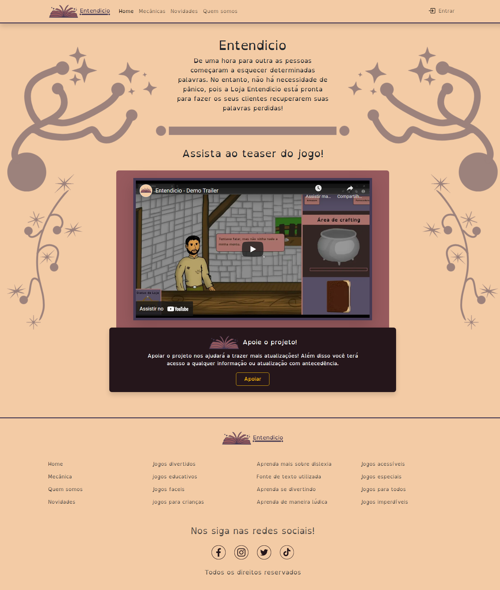

<h1>Projeto Alquimia das Palavras</h1>

Este projeto foi criado para o programa Recode Pro 2022. Um projeto colaborativo criado para ajudar pessoas com baixa proficiência em leitura, com foco no público com dislexia.

<a href="https://projeto-final-recode-2022.vercel.app/">Link para o site</a>

<h2>Colaboradores</h2>
<table border>
    <tbody>
        <tr>
            <td align="center">
                
                <h3>Lucas Emanuel</h3>
            </td>
            <td align="center">
                
                <h3>Larissa Lavinia</h3>
            </td>
            <td align="center">
                
                
                <h3>Fabrício José</h3>
            </td>
        </tr>
        <tr>
            <td align="center">
                
                <h3>Sarah Salles</h3>
            </td>
            <td align="center">
                
                <h3>Bruno Araujo</h3>
            </td>
            <td align="center">
                
                <h3>Tales de Oliveira</h3>
            </td>
        </tr>
    </tbody>
</table>

<h2>Escopo do Projeto</h2>

    <b>Squad nº 24</b> 
    <b>Nome do líder</b>: Tales De Oliveira Gomes 
    <b>Nome do Vice-líder</b>: Larissa Lavinia Alves Dos Santos Ferreira 
    <b>Demais integrantes</b>: 

<ol>
    <li>Bruno Macedo De Araujo</li> 
    <li>Fabricio José Dos Santos</li>
    <li>Sarah Dos Santos Salles</li>
    <li>Lucas Emanuel Santana Dos Santos</li>
</ol>

    <b>1. Qual foi o desafio escolhido?</b>
     
    (X) DESAFIO 5 - Baixa proficiência em leitura

    <b>2. Considerando o desafio escolhido, qual é o problema a ser resolvido e que será contemplado com o projeto final?</b>
     
    Sob qualquer perspectiva da comunicação, podemos dizer que ler e escrever são condições necessárias para se viver em sociedade. No entanto, a dislexia que consiste em um transtorno específico de aprendizagem de origem neurobiológica pode dificultar o desenvolvimento da leitura, da escrita e até mesmo da fala. Por essa razão, estamos trabalhando para resolver o problema de Baixa Proficiência em Leitura percebida em indivíduos que apresentem dificuldade na habilidade de ler.
    

    <b>3. Qual o público-alvo? A solução poderá ser aplicada a todos, sem restrição de idade ou grau de escolaridade, por exemplo?</b>
     
    O público alvo são crianças e adolescentes em idade escolar com transtorno de aprendizagem (Dislexia), que poderão utilizar o App como um suporte para aperfeiçoar a leitura e a compreensão textual.

    <b>4. O problema foi escolhido com base em quais dados oficiais? Como vocês identificaram que esse realmente é um problema para o público-alvo? Indique as referências usadas, justificando a sua escolha.</b>
     
    Em pesquisa online por informações que embasassem o tema escolhido, nos deparamos com o seguinte parecer integrado no Portal do Mec: “Segundo a Associação Brasileira de Dislexia (ABD), a dislexia é o distúrbio de maior incidência nas salas de aula e atinge entre 5% e 17% da população mundial. A ABD define dislexia como um distúrbio ou transtorno de aprendizagem na área da leitura, escrita e soletração.” 
    Apoiado nessa informação identificamos que as crianças e adolescentes em idade escolar com transtorno de aprendizagem são diretamente afetadas e necessitam de maior atenção e suporte para vencer os desafios provenientes da dislexia.
    O Portal do Mec (Disponível em "www.portal.mec.gov.br". Acesso em 24, junho, 2022.) é referência, pois é dedicado a regulamentação do ensino superior no Brasil, assim como pesquisa e extensão universitárias que buscam o progresso e benefício da população. 
    A Associação Brasileira de Dislexia (Disponível em "www.dislexia.org.br". Acesso em 24, junho, 2022.) é referência, pois há mais de trinta anos vem promovendo o entendimento acerca da dislexia.

    <b>5. Como esse problema afeta o público-alvo?</b>
     
    A baixa proficiência em leitura pode afetar a habilidade do indivíduo em construir uma argumentação elaborada, de adquirir conhecimento prévio, pobreza de vocabulário, e principalmente, o deixar inapto na formação de opinião. Além disso, pessoas que não praticam a leitura são menos criativas e apresentam dificuldade na compreensão textual, e isso pode ocasionar a perca de oportunidade de desenvolvimento pessoal e profissional.

    <b>6. Qual o cronograma das atividades?</b>
     
    Pensamos em promover um rodizio na distribuição das tarefas para que todos tenhamos a oportunidade de aprender trabalhando e se desafiando a cada entrega.

    <b>7. Como será feita a distribuição das atividades entre os integrantes do squad para essa primeira entrega?</b>
     
    Para a realização da atividade, nós dividimos as tarefas de acordo com a predisposição de cada integrante da squad. Quanto a apresentação decidimos que todos devem participar, no entanto, planejamos os pontos específicos para a fala de cada um para não exceder o tempo estimado para a apresentação.

    <b>8. Qual a ferramenta de gerenciamento de projeto será usada para o monitoramento das atividades? Ex: Trello, Asana, Jira, Monday</b>
     
    Para essa primeira entrega nós utilizamos o Microsoft Teams para nos reunir, discutir, planejar, distribuir as tarefas e trabalhar no projeto. Além do Teams, nós usamos o whatsApp para nos manter atualizados das tarefas já realizadas e das que ainda estavam pendentes junto com o prazo estimado para a conclusão da mesma.

